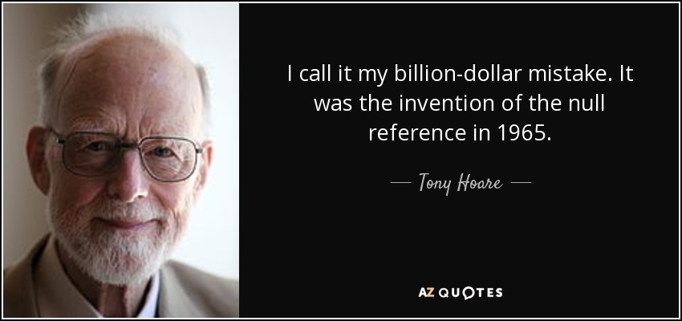

---
html:
  embed_local_images: true
  embed_svg: true
  offline: false
  toc: true
export_on_save:
  html: true
---

Typescript 中文教程：

[GitHub - TypeScript 使用手册（中文版）翻译。](https://github.com/zhongsp/TypeScript)

# 为何要使用 TypeScript?

"可维护性"是一个大型项目重要的一部分, 而类型系统的好坏又影响着项目的可维护性。

任何一个语言在运行时都有着具体的类型的，不同的类型对应不同的数据结构，强类型与弱类型的的区别就在于：编译期标注所有变量的具体类型，并且其类型一旦声明，就不许发生改变。

JavaScript 这种弱类型语言的问题就在于：写代码的时候不知道变量的类型，就很容易在运行时踩到坑里。

例如一个 JS 排序的例子：

```tsx
[1, 2, 10].sort();
```

其排序结果为：

```tsx
[1, 10, 2];
```

这明显是很让人疑惑的一个结果。

其原因是 JS 是弱型语言，解释器并不知道数组内会存什么类型，为了通用性只能将 Array 每个成员都隐式转换为 string 类型，JS 使用的是 Unicode 编码，结果是逐字符的 Unicode 编码比较。

想得到正确的结果就必须传一个 number 类型比较函数：

```tsx
[1, 2, 10].sort((left, right) => left - right);
```

这个问题在 MongoDB 数据库上的影响尤为严重，MongoDB 的字段是动态类型的，没有任何约束。在整形字段中混入字符串类型，就会发生排序错误。

弱类型给团队合作造成不便，当你在给别人用的接口代码上没有详细的类型注解，别人就很难弄明白这个接口要传什么参数。除非你能勤勤恳恳的给接口代码都加上注释，写上说明文档告诉别人这个参数该传什么类型，那个参数不该传什么东西。当你这么干之后就会发现，还是强类型更方便，编译器会帮你做好所有的约束。还有最重要的是要配合一个好的 IDE，强类型所带来的智能感知，让你写起代码来如丝般顺滑。并且可以很方便的自动重构你的代码。

# 类型系统：

TypeScript 的类型系统和 Java 的不同点是 TS 是代数数据类型（Algebraic data types），可以通过类型间的逻辑组合产生新的类型，这比 Java 或 Kotlin 的类型系统更为灵活。

例如如下两个类型：

```tsx
class Left {
  a = 0;

  b = 0;
}

class Right {
  b = 0;

  c = 0;
}
```

## 联合类型(Union Types)

```tsx
//参数类型为Left或者Right
function Test(p: Left | Right) {
  //对联合类型取值只能取其属性交集
  //ok
  p.b;

  //错误
  p.c;

  //判断字段c是否存在
  if ('c' in p) {
    p.c; //自动类型转换Right
  }

  //手动类型转换 ok,但是运行时可能会有问题，as类型转换只存在于编译期,相当于一种欺骗编译器的手段
  (p as Right).c;
}

//ok,满足Left
Test({
  a: 1,
  b: 1,
});

//ok,满足Right
Test({
  c: 1,
  b: 1,
});

//错误，不满足Left或Right
Test({
  b: 1,
});
```

## 交叉类型(Intersection Types)

```tsx
//参数类型为Left并且Right
function Test(p: Left & Right) {
  //对交叉类型可以取属性并集
  //ok
  p.a;

  //ok
  p.b;

  //ok
  p.c;
}

//ok,同时满足Left与Right
Test({
  a: 1,
  b: 1,
  c: 1,
});
```

## any 类型

any 类型相当于再类型系统上开的后门。any 可以接受任意类型，也可以传递给任意类型

```tsx
let a: any = 0;

let b: string = a;

//通过编译，运行时报错，number类型没有charAt函数
b.charAt(0);

let c: number = '123' as any;
```

这种绕过类型系统的行为容易产生问题，一般只在迫不得已时使用。

## unknown 类型

unknown 属于严格版的 any 类型：可以接收任意类型，但不能传递给其他非 unknown 类型, 类似于 Java 的 Object 类型

```tsx
function test(p: unknown) {
  console.log(p);

  //报错
  let b: number = p;

  //判断后赋值，ok
  if (typeof p === 'number') {
    let b: number = p;
  }
}

//传递任意类型,ok
test(1);
test('123');
```

## null-able 空类型

Java 有一个著名的：“价值十亿美元的错误“，就是指因为少做空指针判断而产生的 Bug.



TypeScript 有与 Kotlin 类似的空类型检测：--strictNullChecks 或 --strict

```tsx
let s = 'foo';
s = null; // 错误, 'null'不能赋值给'string'

let sn: string | null = 'bar';
sn = null; // ok

sn = undefined; // 错误

let sn2: string | undefined = 'bar';
sn2 = undefined; // ok

if (sn != null) {
  //使用前判断
  sn.charAt(0);
}

//？.号简化空值判断（Optional Chaining）可选链
sn?.charAt(0)?.charAt(0);

//？？号空值合并运算符
//当左侧的值为空时返回右侧的值
let sn3 = sn?.charAt(0) ?? '';
```

## 函数类型

TS 和 Kotlin 类似，都有着一等函数类型，并且更偏向于函数式编程，在 TS 中定义一个函数类型如下：

```tsx
let a: (p: string) => void = p => {};
```

以上定义了一个变量 a 其类型为：单 string 入参，void 无返回值函数，然后将箭头函数 p=>{}赋值给变量 a.

将函数单独定义为一个类型，以便阅读：

```tsx
//使用type关键子定义类型别名
type Func1 = (p: string) => void;

let b: Func1 = p => {};
```

## class 类型

在 Java 里有 Class<T>类型用于运行期反射，或者获取 class 的元信息，相对应的 TS 中 class 类型的写法为:

```tsx
//无参构造函数
type ClassType = {new (): any};

//有构造函数
type ClassType2 = {new (p1: string): any};
```

使用：

```tsx
class Test {
  a = 1;

  constructor(p: string) {}
}

function c(p: ClassType2) {
  return new p('123');
}

let res = c(Test); //res为any类型

//ok
res.a;

//ok,通过编译，运行期会出问题
res.b;
```

使用泛型改进以上例子：

## 泛型

TS 的泛型和 Java 类似，只存在于编译期，运行期会进行类型擦除。

将上诉 ClassType 与函数 c 改为泛型：

```tsx
type ClassType<T> = {new (): T};

class Test {
  a = 1;
}

function c<T>(p: ClassType<T>) {
  return new p();
}

let res = c(Test); //res为Test类型

//ok
res.a;

//报错，编译不通过
res.b;
```

如上所示，使用泛型我们可以在参数传递过程中保证类型安全。

当然 TS 泛型还远不止于此，TS 的泛型是一套图灵完备系统，可以进行类似 C++的编译期元编程。

具体作为进阶学习，可以参考 TS 语言规范：

[TypeScript/spec-ARCHIVED.md at master · microsoft/TypeScript · GitHub](https://github.com/microsoft/TypeScript/blob/master/doc/spec-ARCHIVED.md)

# 函数式与面向对象

各种模式的核心都是为了实现多态, 这里讲解一下如何分别用函数式与面向对象法实现运行时多态。

首先假设我们有一个加法函数:

```tsx
function add(a: number, b: number): number {
  a++;
  b++;
  return a + b;
}
```

现在需求变动，需要将中间运算结果全部打印出来，我们可能会这样改动原函数：

```tsx
function add(a: number, b: number): number {
  a++;
  console.log(a);
  b++;
  console.log(b);
  return a + b;
}
```

接下来，调用者的需求还有可能会发生改变，调用者有时不想将中间数显示在控制台，而是写入到文件中。

ok, 我们再改一下设计, 加一个 boolean 类型参数控制显示方式：

```tsx
function add(a: number, b: number, file: boolean): number {
  a++;
  if (file) writeFile(a);
  else console.log(a);

  b++;
  if (file) writeFile(b);
  else console.log(b);

  return a + b;
}
```

功能实现，但实际还可能有问题，调用者可能产生第三种需求：同时打印到控制台与写入文件，此时我再用 if 语法改设计就变得非常麻烦。

## 函数式设计：

将调用者可能的需求变动转换一个函数来传递，由用户自己决定进行何种打印行为：

```tsx
function add(a: number, b: number, addResult: (p: number) => void): number {
  a++;
  addResult(a);

  b++;
  addResult(b);

  return a + b;
}
```

用户调用：

```tsx
add(1, 2, res => {
  //同时打印与写入文件
  console.log(res);
  writeFile(a);
});
```

以上是函数式多态的实现。

## 面向对象设计：

当然我们也可以采用类似 Java 传统的面向对象设计：

```tsx
class Base {
  add(a: number, b: number) {
    a++;
    this.addResult(a);

    b++;
    this.addResult(b);

    return a + b;
  }

  addResult(res: number) {}
}
```

用户使用:

```tsx
class MyBase extends Base {
  addResult(res: number) {
    //打印中间结果
    console.log(res);
  }
}

new MyBase().add(1, 2);
```

以上是一个子类型多态的实现，比函数式要略微麻烦一点。

函数式里独有的设计：无副作用，柯里化(Currying)，CPS 变换，lambda 函数与闭包, map reduce filter.

有关 map/reduce/filter 详细教程可以查看：

https://zhuanlan.zhihu.com/p/62108150
