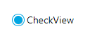

---

html:
  embed_local_images: true
  embed_svg: true
  offline: false
  toc: true
export_on_save:
  html: true
---


# UI组件

UI组件存放位置：`src/rn-common/components`

这些组件都已进行过跨平台一致性测试，确保在移动端与web端都可以达到相似的效果。


------

## V 基础布局组件

所有布局或文本显示都需要使用此组件，用于代替div等，默认以flex box column布局。

```tsx
    //纵向
    <V>
        <V>文本1</V>
        <V>文本2</V>
    </V>
    //横向
    <V style={{ flexDirection: "row" }}>
        <V>文本3</V>
        <V>文本4</V>
    </V>
```

> 所有react组件均为大写开头

&nbsp; 
&nbsp; 

------

&nbsp; 
&nbsp;

## Gradient 渐变色组件

```tsx
    //45度角渐变背景
  <Gradient 
    
    //角度
    angle={45} useAngle={true} 

    //渐变色数组
    colors={['#ced8f3', '#192f6a']}

    style={{ padding: 10, }}>
        <V>文本</V>
    </Gradient>
```

&nbsp; 
&nbsp; 

------

&nbsp; 
&nbsp;

## ButtonView 按钮

默认为圆角，且带阴影的可点击按钮。

```tsx
            <ButtonView 
                onPress={() => {
                    //点击事件
                 }} 
                >登录</ButtonView>
```


也可以设置style来修改其颜色，禁用圆角与阴影：

```tsx
                <ButtonView
                    noShadow={true}  //禁用阴影
                    style={{
                        borderRadius: 0,   //无圆角
                        backgroundColor: colors.green, //背景色
                    }}>登录</ButtonView>
```


或者嵌套子View:

```tsx
                <ButtonView style={{ backgroundColor: colors.orangeDark, borderRadius: 360 }}>
                    {/* 主轴为横向flex布局, 内容沿侧轴(纵向)居中对齐 */}
                    <V style={[ { flexDirection: "row" , alignItems: "center" }]}>
                        {/* 红色圆点 */}
                        <V style={{ backgroundColor: colors.red, borderRadius: 360, width: 10, height: 10 }} />
                        <V style={{ color: colors.white, marginLeft: 10 }}>登录</V>
                    </V>
                </ButtonView>
```


&nbsp; 
&nbsp; 

------

&nbsp; 
&nbsp; 

## PressView 可点击视图
默认为无样式flex box column布局, 点击后背景变灰(android端为涟漪动画),一般用来作为可点击区域的主容器.

&nbsp; 
&nbsp; 

------

&nbsp; 
&nbsp; 


## EditView 文本输入


默认为无边框的文本输入组件

```tsx
                <EditView
                    placeholder="请输入文本"
                    style={{ width: "100%", borderWidth:1 }}
                />
```


> 注意：EditView不支持嵌套子View


配合state获取输入值：
```tsx
//输入内容变动时会自动同步给state
const st = useObjState(() => ({
        username: "jszc",
        check: true,
        switch: true,
    }));
```

使用state:
```tsx
                <EditView
                    state={[st, "username"]}
                    placeholder="请输入文本"
                    style={{ width: "100%" }}
                />
```

EditView的其他属性可参考[TextInput](https://reactnative.cn/docs/textinput)

&nbsp; 
&nbsp; 

------

&nbsp; 
&nbsp; 

## CheckView 选项



```tsx
<CheckView 
    state={[st, "check"]}
    style={{ padding: 10 }}>CheckView</CheckView>
```

支持的属性：

```tsx
export interface CheckViewProp extends ViewProps {

    /**
     * 点击事件
     */
    onPress?: (checked: boolean) => void;

    /**
     * 是否选中
     */
    checked?: boolean;


    /**
     * 是否将checkBox显示在右边(默认左边)
     */
    rightPos?: boolean;

    /**
     * 大小,默认18
     */
    size?: number;

    /**
     * 使用带边框的选项代替,checkbox
     */
    border?: boolean;
}
```


&nbsp; 
&nbsp; 

------

&nbsp; 
&nbsp; 

## SwitchView 开关


```tsx
   <SwitchView
                        state={[st, "switch"]} />
```


&nbsp; 
&nbsp; 

------

&nbsp; 
&nbsp; 

## SliderView 滑块


可拖动的滑动输入条。

```tsx
                <SliderView
                    trackPressable={true}
                    maximumTrackTintColor={colors.greyA}
                    minimumTrackTintColor={colors.blueLight}
                    thumbStyle={{ height: 20, width: 20 }}
                    thumbTintColor={colors.white}
                />
```


&nbsp; 
&nbsp; 

------

&nbsp; 
&nbsp; 

## Pic 图片显示

source图片源可以为网络url或本地图片。

对于网络图片，会自动显示加载状态，加载成功后会自动缓存至本地。


```tsx
   <Pic
        //显示本地文件
        source={imgs.ic_account}
        style={[{
            //只需设置一个高或宽，图片会自动按比例显示
            height: 25,
        },]}
```

&nbsp; 
&nbsp; 

------

&nbsp; 
&nbsp; 


## TableView 表格


```tsx
    <TableView
        //每个单元格的样式回调
        onItemStyle={(row, col) => ({
            backgroundColor: colors.blue,
            borderColor: colors.orange,
            color: colors.white,
        })}>
        {
            [
                //第0行,列0横向占2格
                [{ text: "列0", row: 2 }, { text: "列1" }],
                //第一行
                [{ text: "列0" }, { text: "列1" }, { text: "列2" }],
            ]
        }
    </TableView>

```

&nbsp; 
&nbsp; 

------

&nbsp; 
&nbsp; 


## OptionView 单选弹窗

点击后弹出选择列表, 同样是通过state绑定状态:


```tsx
            <OptionView
                state={[st, "typeId"]}
                style={[{},]}
                options={[
                    {
                        key:"0",
                        val:"选项0",
                    },
                    {
                        key:"1",
                        val:"选项1",
                    },
                ]}
            />
```

&nbsp; 
&nbsp; 

------

&nbsp; 
&nbsp;

## ExpandCard 可折叠卡片

可点击展开或折叠的卡片

展开:

&nbsp; 

折叠:

&nbsp; 

```tsx
 <ExpandCard

            style={[{}]}

            title={() => <V style={[{ fontSize: 16, flex: 1 },]}>标题</V>}

            expand={() =>
                <V style={[{ marginTop: 12, backgroundColor: colors.white }]}>
                    展开内容
                </V>
            }
        />
```


------

&nbsp; 
&nbsp;

## ExpandText 可折叠文本

通过numberOfLines限定文本最大行数, 超出部分显示...省略号. 可点击展开显示全部内容.

```tsx
  <ExpandText
                                numberOfLines={1}
                                style={{ alignSelf: 'center', }}>
                                文本内容
                            </ExpandText>
```

&nbsp; 
&nbsp; 

------

&nbsp; 
&nbsp; 

## Icon 图标库
material图标库
```tsx
        <Icon name="people" size={20} color="#000000"/>
```

&nbsp; 
&nbsp; 

------

&nbsp; 
&nbsp; 

## IconText 图标文本

左侧显示小图标的文本组件


```tsx
        <IconText name="people">
            文本
        </IconText>
```

&nbsp; 
&nbsp; 

------

&nbsp; 
&nbsp; 


## SearchView 搜索框

非light样式:

​       ​ 

light样式:

​		

```tsx
   <SearchView
       				//绑定输入内容
                    state={st,"text"}
                    numberOfLines={1}
                    light
                    style={{ flex: 1, marginRight: 10, }}
                    placeholder="输入关键词"
                    onSearch={(t) => {
                        //搜索事件

                    }} />
```

&nbsp; 
&nbsp; 

------

&nbsp; 
&nbsp;

## HtmlView

用于显示静态html内容, 自动适应布局.(内置xss过滤)

```tsx
    <HtmlView 
        style={{flex:1}} 
        html={`<p><a href="https://www.com">abcdef</a></p>`} 
    />
```

&nbsp; 
&nbsp; 

------

&nbsp; 
&nbsp; 

## Browser 内置浏览器

调用内置浏览器显示网页(web端使用iframe)

```tsx
  <Browser
                source={{ uri: "https://www.com" }}
                onLoadEnd={() => {
                    //网页加载完成
                }}
                javaScriptEnabled={true}
                style={[{ flex: 1 },]} />
```

&nbsp; 
&nbsp; 

------

&nbsp; 
&nbsp; 

## Marquee 跑马灯

从上至下滚动显示的跑马灯

```tsx
 <Marquee
                    data={
                        ["111111111", "2222222222", "333333", "44444", "55555"]
                    }
                    duration={1000}
                    delay={2000}
                    toValue={23}
                    renderItem={(e, i) => (
                        <Text
                            key={i}
                            numberOfLines={1}
                            style={[{
                                height: 23,
                                color: colors.black,
                                fontSize: 16,
                            },]} >{e}</Text>
                    )}
                    style={{
                        marginTop: 15,
                        height: 23,
                        alignItems: "center",
                    }}
                />
```

属性：

```tsx
export interface MarqueeProp<T> extends ViewProps {

    //初始数据
    data: Array<T>,

    //成员渲染回调
    renderItem: (d: T, i: number) => any,

    //动画时间
    duration: number,

    //文字停留时间
    delay: number,


    //文本高度
    toValue: number,
}
```


&nbsp; 
&nbsp; 

------

&nbsp; 
&nbsp; 


## PullScroll 下拉刷新Scroll

支持下拉刷新的ScrollView:
```tsx
<PullScroll onRefresh={async () => {
            //下拉刷新回调
        }}>
            <View>
                ....
            </View>
</PullScroll>
```
属性同ScroolView:
https://reactnative.cn/docs/scrollview

&nbsp; 
&nbsp; 

------

&nbsp; 
&nbsp; 


## ScrollPicker 滑动选择器

可以通过上下滑动选择列表内容:


```tsx
<ScrollPicker
                            //数据
                            dataSource={["1月","2月","3月","4月"]}

                            //选中项
                            selectedIndex={0}
                            
                            sizeItem={7} //一屏显示的条目数
                            
                            fontSize={15}
                            
                            onValueChange={(res, idx) => {
                                //res选择结果,idx索引
                                console.log(res,idx);
                            }}

                            style={[{ flex: 1, },]} />
```

&nbsp; 
&nbsp; 

------

&nbsp; 
&nbsp; 

## SwiperView 左右滑动视图

```tsx
  <SwiperView list={[
    {
        icon:<Icon name="people" size={20}>,
        name:"标题1",
        onPress:()=>{

        },
    }
  ]} />
```

&nbsp; 
&nbsp; 

------

&nbsp; 
&nbsp; 

## TabNaviView 底部导航


```tsx
<TabNaviView
                itemPaddingV={15}
                fontSize={15}
                onClick={index => { }}
                style={{}}
                tabStyle={{
                    backgroundColor: colors.background,
                    shadowColor: "#000",
                    shadowOffset: {
                        width: 0,
                        height: -3,
                    },
                    shadowOpacity: 0.08,
                    shadowRadius: 5,
                    elevation: 8,
                }}
                activeColor={colors.primary}
                inactiveColor={colors.grey1}
                data={[
                        {
                            key: "待办",
                            title: "待办",
                            view: () => (
                                <SealApplyList />
                            )
                        },
                        {
                            key: "在办",
                            title: "在办",
                            view: () => (
                                <SealApplyList status="APPROVING" />
                            )
                        },
                        {
                            key: "办结",
                            title: "办结",
                            view: () => (
                                <SealApplyList status="FINISHED" />
                            )
                        },
                        {
                            key: "用章记录",
                            title: "用章记录",
                            view: () => (
                                <MyApplyList />
                            )
                        },
                ]}
                initIndex={0} />
```

&nbsp; 
&nbsp; 

------

&nbsp; 
&nbsp; 

## Calendar 日历

可以嵌入任意页面的日历:


```tsx
        <Calendar
                    onSelect={res => {
                        //选择日期
                        console.log(res);
                    }}
                    style={[{},]}
                    //初始日期
                    date={this.props.date2}
                    //日期选择范围
                    dateRange={[new Date(), new Date()]}
                    //选择选择的日历类型
                    selectType={["year", "month", "day", "hour", "minute"]} 
         />
```

&nbsp; 
&nbsp; 

------

&nbsp; 
&nbsp; 

## RangeDate 范围日期选择


```tsx
<RangeDate
                    style={[{
                    },]}
                    disableTime
                    column={["开始日期", "结束日期"]}
                    onSearch={(start, end) => {
                     
                    }}
                    onSelectStart={date => {

                    }}
                    onSelectEnd={date => {
                       
                    }}
                />
```

&nbsp; 
&nbsp; 

------

&nbsp; 
&nbsp; 

## Dialog 弹窗
全屏遮盖，背景变灰弹窗:


```tsx
                    //显示弹窗
                    Dialog.show({
                        style: { justifyContent: "center", alignItems: "center", },
                        onClose: () => {
                        },
                    }, dialog =>
                        <PressView
                            onPress={() => { dialog.close() }}
                            style={{
                                backgroundColor: colors.white,
                                padding: 10,
                                borderRadius: 10,
                            }}
                        >弹窗</PressView>
                    )
```


通过Dialog.show()函数显示弹窗，其第一个参数为弹窗属性，第二参数为弹窗内容回调。

&nbsp; 
&nbsp; 

------

&nbsp; 
&nbsp; 

## LoadProg 全屏遮盖加载


基于Dialog实现：

```tsx
//显示全屏遮盖加载条
app.loadStart();

//关闭全屏遮盖加载条
app.loadStop();
```

&nbsp; 
&nbsp; 

------

&nbsp; 
&nbsp; 

## DialogList 弹窗选项

```tsx
let res = await DialogList.show(
                            [
                                {
                                    key: "选项1",
                                    val: "value2",
                                },
                                {
                                    key: "选项2",
                                    val: "value2",
                                },
                                {
                                    key: "选项3",
                                    val: "value2",
                                },

                            ]
                        )
```
通过DialogList.show()显示弹窗列表，入参为列表数组。通过await 获取用户点击结果。

&nbsp; 
&nbsp; 

------

&nbsp; 
&nbsp; 


## DialogInput1 输入弹窗
 

```tsx
 let res = await DialogInput1.show({})
```
 show()参数为弹窗属性，同样使用await获取输入结果

&nbsp; 
&nbsp; 

------

&nbsp; 
&nbsp; 

## DialogZone 地区选择弹窗
 

```tsx
let res = await DialogZone.show("", "")
```

show参数为初始省，市,  区。同样使用await 获取选择结果。

&nbsp; 
&nbsp; 

------

&nbsp; 
&nbsp; 

## DialogDate 日期选择弹窗


在屏幕中央弹窗显示日期或时间选择器（基于Dialog与Calendar实现）：

```tsx


let res = await DialogDate.show({})
if(res.ok){
    //通过res.date获取返回结果
    console.log(res.date)
}
```

&nbsp; 
&nbsp; 

------

&nbsp; 
&nbsp; 

## DialogDateDouble 双日期选择

如下所示用于选择开始时间与结束时间.


```tsx


let res = await DialogDateDouble.show({})
if(res.ok){
    console.log(res.date1,res.date2)
}
```

&nbsp; 
&nbsp; 

------

&nbsp; 
&nbsp; 


## PullList 下拉刷新，加载更多

支持自动分页，下拉刷新，自动加载数据的超长列表展示组件。

```tsx
     <PullList<NotiResList>
    
        //初始化时自动加载数据。
        autoLoad={true}
    
        //列表每项显示回调。
        renderItem={it => <PressView><Text>单元{it.index}</Text></PressView>}
    
        //分页数据获取回调
        onGetListByPage={async page => {
            //调用接口
            let res = await api.getNotifyList({}).result;
            //返回Array<>数据
            return res.list;
        }}
    />
```

PullList需要指定一个泛型参数作为其数据列表`Array<T>`的类型。即上例中的`<NotiResList>`。

onGetListByPage为分页数据获取回调，每当刷新或加载更多时都会带入页码参数触发此回调（page页码从1开始）。

&nbsp; 
&nbsp; 

------

&nbsp; 
&nbsp; 

## TreeView 树形列表


```tsx
  <TreeView onInit={node => {//初始化回调}} />
```

递归展示通讯录的例子：

```tsx
//从接口中动态加载节点数据
async function getContact(node: TreeNode, id: string) {
    let ret = await api.getContacts({ departmentGUID: id }).result

    //绑节点数据列表，与显示回调函数，回调参数：（dat数据，subNode子节点）
    node.bindList(ret.RESULT, (dat, subNode) =>
        <PressView
            onPress={() => {//节点点击事件

                //切换节点展开状态
                subNode.toggle();

                if (subNode.notBind)//如果该子节点未绑定数据，递归子节点
                    getContact(subNode, dat.obj.id)
            }}
            style={[{ padding: 15, marginLeft: 20 }, styles.rowCenter]}>
            {dat.type == 2 ? subNode.arrow() : null}
            <Text style={{ marginLeft: 5 }}>{dat.obj.name ?? dat.obj.userName}</Text>
        </PressView>
    )


}

export function Contact() {
    return (
        <ScrollView>
            <TreeView onInit={node => {//初始化回调
                getContact(node, "{00000000-0000-0000-0000-000000000000}")
            }} />
        </ScrollView>
    )
}
```

&nbsp; 
&nbsp; 

------

&nbsp; 
&nbsp; 

## VideoView 视频播放
```tsx
  <VideoView
                autoPlay={false}
                poster="https://UsFQYPtapzL6yml.jpg" //视频加载前的占位图
                style={{
                    backgroundColor: colors.black,
                    width: "100%",
                    aspectRatio:  16 / 9,
                }}
                source={{
                    uri: "https://file-examples-com.github.io/uploads/2017/04/file_example_MP4_640_3MG.mp4",
                }} />

```


&nbsp; 
&nbsp; 

------

&nbsp; 
&nbsp; 


## TabView 左右滑动+标签导航

带导航标签可左右滑动的TabView:
https://github.com/satya164/react-native-tab-view

```tsx
    //tabView 索引
    const [index, setIndex] = useState(0);

    //初始化tab路由
    let routes = Array<TabViewItem>(
        {
            key: "通知列表",
            title: "通知列表",
            view: () => (
                <View />
            )
        },
        {
            key: "通讯录",
            title: "通讯录",
            view: () => (
                <Contact />
            )
        },
    );

   <TabView
                lazy={true}
                tabBarPosition="top"
                navigationState={{ index, routes }}
                renderScene={({ route }) => route.view()}
                onIndexChange={setIndex}
            />
```

&nbsp; 
&nbsp; 

------

&nbsp; 
&nbsp;

## tabBarCommon 标签导航

TabView的导航标签,支持light和dark两种样式:
```tsx
 <TabView
                lazy={true}
                tabBarPosition="top"
                navigationState={{ index, routes }}
                renderScene={({ route }) => route.view()}
                onIndexChange={setIndex}
                 renderTabBar={gmTabBarCommon({
                    light: true,
                    indicatorStyle: {
                        height: 1,
                    },
                    style: gmColors.tabViewShadow,
                })}
            />
```

&nbsp; 
&nbsp; 

------

&nbsp; 
&nbsp;

## DialogFileSelect 选择文件上传
```tsx
    //创建选择文件对话框
    let dialog = new DialogFileSelect() 
                        
    //指定图片选择器，参数为图片裁剪大小（不裁剪可不传参）
    dialog.setAcceptImage(400, 400);

    //显示，并获取结果
    let file:File = await dialog.show();

    //调用上传接口
    await api.uploadOfficeFile({
            file: file,
        }).result;

    //成功提示
    app.msg("上传成功:" + lib.getFileName(file.name))
```


&nbsp; 
&nbsp; 

------

&nbsp; 
&nbsp;

## QRCode 二维码


```tsx
 <QRCode
        size={100}
        color={colors.blue}
        value="二维码的值"
    />
```

&nbsp; 
&nbsp; 

------

&nbsp; 
&nbsp;

## PieChart 饼状图


```tsx
<PieChart
        style={{ width: 200,
             height: 200, 
             alignSelf: "center", marginBottom: 10, }}
        chartDescription={{
            text: "饼图"
        }}
        legend={{
            textSize: 11,
        }}
        data={{
            dataSets: [
                {
                    values: [
                        { value: 25.5, label: 'Sandwiches' },
                        { value: 21, label: 'Salads' },
                        { value: 15, label: 'Soup' },
                        { value: 10, label: 'Beverages2' },
                        { value: 10, label: 'Beverages3' },
                        { value: 9, label: 'Beverages' },
                        { value: 15, label: 'Desserts' },
                        { value: 15, label: 'Desserts2' },
                    ],
                    config: {
                        drawValues: true,
                        valueTextSize: 12,
                        valueTextColor: colors.white,
                        sliceSpace: 1,
                        valueFormatter: "#.#'%'",
                    }
                }
            ]
        }}
    />
```

&nbsp; 
&nbsp; 

------

&nbsp; 
&nbsp;


# API


## StorageObject 本地文件对象 

将本地文件自动序列化/反序列化为一个类型安全对象：

```tsx
//待储存的对象
export class UserInfo {

    constructor(
        public userName: string = "",
        //账号
        public loginName: string = "",
        //密码
        public password: string = "",

    ) {


    }

}

//创建全局对象, 参数为：（class, 是否加密, 文件名, 是否为mobX可观察对象）
export user = new StorageObject(UserInfo, false, "UserInfo", true);
```

```tsx
//读取内容
user.dat.userName;

//赋值并保存	
user.dat.userName = "123"
user.save

//清空并保存
user.clear();

//重新赋值整个对象，并保存
user.dat = new UserInfo();
```


&nbsp; 
&nbsp; 

------

&nbsp; 
&nbsp; 


## TypeJson 强类型JSON序列化

解析/反序列化JSON字串：
```tsx
//与JSON.parse()类似，不过需要多传递一个class类型参数
let res = TypeJson.parse(`{"userName":"用户名","password":1234}`,UserInfo);
```

TypeJson.parse会将JSON字串尽可能的“修复”为一个UserInfo对象 , 上例的返回结果如下：

```tsx
//JSON字串中不存在或者为null的字段（loginName），将会使用UserInfo的默认值。
//并且会对不正确的类型进行自动转换（password被转为了string类型）
UserInfo{
	userName:"用户名"，
	loginName:"",
	password:"1234",
}
```

需要注意的一点是TypeScript的泛型是纯编译期实现， 类似Java的泛型，都有运行期类型擦除。所以如下类型声明会有问题：

```tsx
export class UserList {

    //这里Array的泛型参数只存在于编译期，运行期是无法获得的。
    public list: UserInfo[] = Array<UserInfo>();
    
    //同样不行
    public listStr: string[] = [];
}

//无法正确转换list数组的UserInfo对象
let res = TypeJson.parse(`{list:[{"userName":"用户名","password":1234}]}`,UserList);

console.log(res)
//res结果不正确：
//UserList { list: [ { userName: '用户名', password: 1234 } ], listStr: [] }
```


需要改为使用array()函数来进行数组创建：

```tsx
import { array, arrayString } from "../src/lib/lib";

export class UserList {

  //将类型作为array函数的第一个参数传递
  public list = array(UserInfo);

  //string类型数组(通过lib.getArrayType()来获取数组对应的类型)
  public listStr = arrayString();

  //二维数组
  public list2 = array(array(UserInfo));
}


let res = TypeJson.parse(`{list:[{"userName":"用户名","password":1234}]}`, UserList);

console.log(res)
```
正确结果：
```tsx

UserList {
  list: [
    UserInfo { userName: '用户名', loginName: '', password: '1234' },
  ],
  listStr: [],
  list2: []
}
```

对象转JSON/序列化：

```tsx
//同JSON.stringify()
TypeJson.stringify(new UserList());
```

当JSON字串里的类型飘忽不定，或者可为null时， 可以采用如下类型定义：

```tsx
export class UserList {

  //使用nullAble装饰器，指定此属性可以为null或undefined
  @TypeJson.nullAble
  public field1? = "";

  //any类型属性，以针对飘忽不定的类型
  public field12:any = {}

}
```

&nbsp; 
&nbsp; 

------

&nbsp; 
&nbsp;

## 扩展函数

src/rn-common/lib/ext.ts定义的有对基本类型string或Array等的扩展函数:

```tsx
declare global {


    export interface String {
        /**
         * 移除最后一个字符
         */
        removeLast(): string;
        /**
         * html转义
         */
        htmlEncode(): string;

    }

    export interface Array<T> {

        /**
         * 遍历数组,func返回false则中断
         * @param func
         */
        each(func: (val: T) => boolean): boolean;

        /**
         * 遍历并转换数组成员为int,遇到NaN返回false,func返回false则中断
         */
        eachToInt(func?: (val: number) => boolean): boolean;

        /**
         *遍历并转换数组成员为float,func返回false则中断
         */
        eachToFloat(func?: (val: number) => boolean): boolean;

        /**
         *遍历并转换数组成员为string,func返回false则中断
         */
        eachToString(func?: (val: string) => boolean): boolean;

        /**
         * 二分查找,返回索引位置(未找到返回-1)
         * 回调里返回（目标值-itm中间值）> 0为正序,搜索后半部分，反之倒序
         * @param func
         */
        binarySearch(func: (itm: T) => number): number;


        /**
         * 遍历array并将func返回结果拼接为string
         */
        mapString(func: (itm: T, index: number) => any): string;

        /**
         * 向指定位置添加元素
         * @param index
         * @param val
         */
        add(index: number, val: T | T[]): this;

        /**
         * 同map函数，支持async与await
         * @param callbackfn
         */
        mapPromise<U>(callbackfn: (value: T, index: number, array: T[]) => Promise<U>): Promise<U[]>;
        
        /**
         * 遍历array并将func返回结果拼接为string,支持async与await
         * @param callbackfn
         */
        mapStringPromise(callbackfn: (value: T, index: number) => Promise<any>): Promise<string>;

    }
}
```

&nbsp; 
&nbsp; 

------

&nbsp; 
&nbsp;


## lib.ts 工具库

lib/lib.ts除了上诉提过的array(...) arrayNumber() arrayString()函数等，还有以下api:

### gbk 编解码系列：
```tsx
lib.gbkEncode()
lib.gbkDecode()
lib.gbkEncodeURI()
lib.gbkDecodeURI()
lib.gbkEncodeURIComponent()
lib.gbkDecodeURIComponent()
```

### md5 编码：
```tsx
lib.md5hex()
lib.md5base64()
lib.md5hex_hmac()
```

### lib.objToForm
将object转换为form表单格式字串

### lib.compare
比较数字或字串

### lib.parseDate
将字符串如'2014-09-13' 解析成Date日期

### lib.dateToY_M_D 与 dateToY_M_D_H_M_S

将Date日期或时间戳，转换成日期字串：'2014-09-13'

### lib.showByte

将字节number，转为Byte/KB/MB/GB/TB字串：

### lib.loadScript

动态加载js脚本(仅限web端)

### lib.solar2lunar  公历转农历

公历年月日转农历数据

### lunar2solar 农历转公历

农历年月日转公历年月日

.......

&nbsp; 
&nbsp; 

------

&nbsp; 
&nbsp;

## app.ts 界面相关工具库

### app.push
打开新界面（入栈）：

### app.replace
替换当前界面 (替换栈顶)：

### app.pop
关闭当前界面（出栈）：

### app.msg
弹出底部toast消息

### app.showPhotoViewer
打开图片浏览器
app.showPhotoViewer(["url"], 0)

### app.getItem
获取本地存储的：键->值

### app.setItem
设置本地存储（web端为LocalStorage）的：键->值

### app.writeLog
写入本地文件日志（web端无效）

### app.onCatchError
默认全局异常捕获行为：弹出错误提示框

### app.msgOK
弹出带确定按钮的对话框

### app.loadStart()
显示全屏遮盖加载进度条

### app.loadStop()
关闭全屏遮盖加载进度条

### app.rootGroup
全局根组件，可以绕过screen导航直接向屏幕顶层添加组件：
```tsx
    let view = <Text></Text>

    //添加
    app.rootGroup?.addView(view)
    //移除
    app.rootGroup?.removeView(view)
```


&nbsp; 
&nbsp; 

------

&nbsp; 
&nbsp;

## native原生api

`src/rn-common/lib/native.ts` 为移动端原生api, 仅限于android或ios使用.

