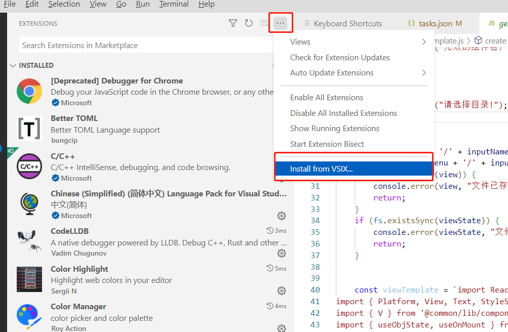
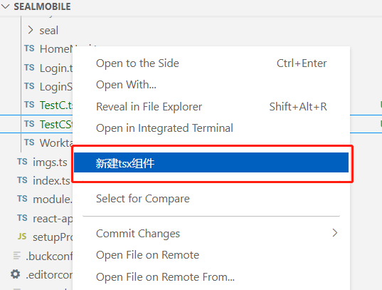

---
html:
  embed_local_images: true
  embed_svg: true
  offline: false
  toc: true
export_on_save:
  html: true
---

## 该框架的优势:

### 完全类型安全

例如 angular 在路由,与 css 样式上完全没有做到类型安全, 这给后期的维护带来一定的困难.

vue 更严重一点, 很多 ts 语法利用率都不完善, 像 vuex,路由,组件都不在乎类型安全.

而 react 开发团队成员大部分都是学院派函数式编程专家, 所以对 ts 的兼容是最完善的.

### 高度自动化

包括 model 数据模型, api 接口, 路由, 都可以由工具+插件自动生成, 保证了和服务端 DTO, 数据库表 Entity 以及 api 的同步类型安全, 大大提升开发效率与可维护性.

### 简化概念,易于学习使用

TSX(强类型版 JSX)为内部 DSL 实现, 掌握 TS 语法即可, 不用学习像 template 这种外部 DSL 语法.

React 也是唯一一个值得让微软官方为其实现 TSX 语法的框架, TSX 的出现既弥补了 TypeScript 语法上的不足, 也使得很多框架设计有了新的思路.

灵活而简易的状态管理. 通过一个函数 findState + class 模型即可实现任意复杂度的状态管理.

比起 vue 的 vuex, 以及 angular 的依赖注入,Service 与管道等等概念, 要更为简单与灵活.

### 面向未来

对前端来说: 内部 DSL, All in JS/TS 就是未来.

对后端来说: 未来是协程 + 事件驱动.

### 内部 DSL 与外部 DSL

`DSL`全称为: `Domain-specific language`(领域特定语言). 像我们所熟悉的 css/less/sass/xml/SQL/HTML 都是一种 DSL. **外部**是指相对于我们使用的主语言 JS/TS 来说, `css`是一种外部语言.

由此便可以看出我们现在编程的主要困境: 开发一个项目要将多种语言组合起来, 我们需要学习多种语法, 多种语言间还有额外的通讯成本, 且难以实现类型安全, 灵活性不足.

人们便开始思考为何不将主语言的语法扩充完善一下，并且脚本化，不就不需要外部 DSL 了?

于是就有了`JSX/TSX`. 以及一些现代编程语言：`Kotlin`, `Scala`, `Swift`, `Groovy`. 这些语言在诞生之初的宣传口号之一就是强大的`内部DSL`能力．例如现在新的 UI 框架：Google 的`Kotlin Compose`与`Flutter` , Apple 的`Swift UI`, 都完全仿照了 React 的开发模式，不需要再引入像`XML`之类的外部 DSL. 还有用来代替 Maven 的 Gradle(支持 Groovy 与 Kotlin 两种语言). 发展趋势都是将外部 DSL 转为内部 DSL。

vue 也引入了 JSX/TSX，在这一点上算是部分拥抱了未来。例如 ant design vue，就是完全使用 tsx 实现.

更多关于 DSL 的说明可以参照 PL(Programming Language)领域名人`王垠`的文章：

http://www.yinwang.org/blog-cn/2017/05/25/dsl

## react-native-web 跨平台方案

react-native 大家应该都很熟悉了, 有多年历史的老牌 native 跨平台框架. 是 react 的一个重要的衍生产品.

在 android 与 ios 端, Facebook 开发有一套 metro 工具集, 专门用于将 react 代码编译打包成对应平台的原生 app.

对于 web 端, 要更为简单一点, react-native 只是作为一个组件库与 api 存在, 利用现成的 webpack 打包.

在 windows 端, 有 Microsoft 开发的一套工具集将 react-native 编译打包成 windows app.

国内也有开源的 react-native 编译到小程序方案.

本框架主要目标是将以上各个解决方案整合起来, 提供一套统一简洁易用的 Api, 并制定工程化的开发规范.

## 初始化项目

react native 使用 node.js 开发, 需要安装 node.js 运行环境:

https://nodejs.org/en/download/

开发工具为 VS code.

react 文档：

https://zh-hans.reactjs.org/docs/getting-started.html

react native 组件库文档:

https://reactnative.cn/docs/components-and-apis

### Clone 代码模板

可以直接从 git 上克隆一个空项目模板.

```shell
git pull  --recursive  https://gitlab.xixian.com/android/reactTemplate.git
```

因为该项目包含子模块, 所以需要使用`--recursive`递归克隆

# 安装插件:

## chrome 端 react 调试插件：

> 组件调试插件：[react-developer-tools](https://chrome.google.com/webstore/detail/react-developer-tools/fmkadmapgofadopljbjfkapdkoienihi)

在 chrome 开发工具 Component 中配置 Open in Editor URL:

```
vscode://file/{path}:{line}
```

这样可以直接从开发工具里的组件树跳转至 vsCode 代码, 以便于开发

## VsCode 端:

> 颜色预览 插件：[Flutter Color](https://marketplace.visualstudio.com/items?itemName=circlecodesolution.ccs-flutter-color)

> 图片预览插件：[Image preview](https://marketplace.visualstudio.com/items?itemName=kisstkondoros.vscode-gutter-preview)

> 组件创建, 路由注册插件：[rnweb-0.0.4.vsix](rnweb-0.0.4.vsix)
> 该插件暂未发布到 vsCode 市场, 需要手动从本地安装:



插件安装之后在对应目录下右键:"新建 tsx 组件", 即可创建一个 react 组件.



# 项目初始化：

先全局安装 yarn 包管理工具:

```shell
npm install yarn -g
```

然后在项目根目录下:

```shell
yarn install
```

# 运行项目：

项目中配置有 NPM 脚本以便于运行，编译，打包

```shell
#运行web端项目，并启动本地http服务，浏览器访问地址为：http://localhost:3000/
run web
```

```shell
#编译并打包web端至build目录下
build web
```

```shell
#以 debug 模式运行 android端app, 需要本机装有android stuido，sdk与java
android
```

```shell
#编译并打包android端app至build 目录
build android apk
```

```shell
#编译并打包android端热更新js文件至build 目录
build android js
```

# 项目入口文件：

```shell
src/index.tsx
```

react 在编译时会根据文件名.web 来区分不同平台的代码。

或者在运行时判断目标平台：

```typescript
import {Platform} from 'react-native';

if (Platform.OS === 'web') {
} else if (Platform.OS === 'android') {
} else if (Platform.OS === 'ios') {
}
```

对于跨平台应用，要尽量使用[组件库](组件库.html)中的组件。像`<div>` css 之类的 dom 元素则只能在 web 端运行。

# 编译配置文件：

### 跨端公用：

```js
package.json;
tsconfig.json; //typescript配置
```

### web 端:

```js
config - overrides.js; //webpack与babel
src / setupProxy.js; //web http服务器配置
```

web 端使用 react scripts 构建，默认无法更改其 webpack 配置，这里使用： [react-app-rewired](https://github.com/timarney/react-app-rewired/blob/master/README_zh.md) 与 customize-cra 重写其配置

### web 端开发模式 Http 代理配置

```
src/setupProxy.js
```

### 移动端:

移动端使用 rn metro 构建，有一套单独的 babel 配置与 web 端的 webpack 不同：

```js
babel.config.js;
metro.config.js;
```

# 静态资源：

`public`目录下存放所有 web 端相关的静态资源。

图片文件位于`src/img`目录。

针对不同的.env 参数, 会有不同的子目录,

为了兼容跨平台 app，代码中不能直接引用本地图片路径，需要改为使用 src/imgs.ts，该文件为 json_model 脚本自动生成。针对浏览器会自动生成 src/imgs.web.ts 文件。

> VS Code 图片预览插件：[Image preview](https://marketplace.visualstudio.com/items?itemName=kisstkondoros.vscode-gutter-preview)

# ttf 图标

本项目默认集成有 Material 系列矢量图标(1547 个)组件：`public/MaterialIcons.ttf`

预览地址：
https://fonts.google.com/icons?selected=Material+Icons

通过以下方式使用：

```tsx
//参数为：图标名，大小，颜色
<Icon name="phone" size={30} color={colors.primary} />
```

也可自定义 ttf 图标组件，例如从[https://www.iconfont.cn/](https://www.iconfont.cn/)下载的图片资源。

1.将`iconfont.ttf`文件复制到`public`目录(web 端)，以及`android\app\src\main\assets\fonts`目录(android 端)。

2.编辑 public/index.html 添加对应的样式

```css
@font-face {
  font-family: 'iconfont';
  font-style: normal;
  src: url(iconfont.ttf);
}
```

3.将`iconfont.json`文件拖入`生成icon.bat`批处理文件即可自动生成对应的`iconfont.ts`图标组件。

# Component 组件

Component 组件是 React 的核心，过去 Component 都为 class + 继承实现，如今 React16 加入了更为简洁的函数式组件。

`.vscode/react.code-snippets`文件为组件的代码模板.

在 vscode 代码编辑器里输入 reac 回车，即可自动生成 class 组件代码模板(函数组件通过插件创建).

class 与函数式两种模式都有一些需要注意的坑点：

## class 组件

```tsx
//组件的属性
export interface ExampleProps {}

//组件的状态
export class ExampleState {
  count = 0;
}

//继承Component<属性，状态>实现自定义组件
export class Example extends Component<ExampleProps, ExampleState> {
  constructor(props: ExampleProps) {
    super(props);
    this.state = new ExampleState();
  }

  //有this指向问题
  onClick() {
    this.setState({count: this.state.count + 1});
  }

  //ok, 使用箭头函数捕获外部this, 没有问题
  onClick2 = () => {
    this.setState({count: this.state.count + 1});
  };

  componentDidMount() {
    //组件创建
  }

  componentWillUnmount() {
    //组件销毁
  }

  render() {
    return (
      <ButtonView onPress={() => this.onClick()}>
        点击次数：{this.state.count}
      </ButtonView>
    );
  }
}
```

以上是一个带属性与状态的强类型 tsx 组件，功能很简单：每次点击按钮将 count 状态+1.

需要注意的一点是每次修改状态后都会触发 render()函数， 所以这里面不要放耗时的操作。

还有一点就是 JavaScript this 指向的坑：

```tsx
//onPress属性改为直接传递this.onClick函数，错误！
<ButtonView onPress={this.onClick}>点击次数：{this.state.count}</ButtonView>
```

上例中 onClick 调用时会丢失 this 指针。onClick 函数里获取到的 this 值为`undefined`。

```tsx
//手动绑定this，OK.
<ButtonView onPress={this.onClick.bind(this)}>
  点击次数：{this.state.count}
</ButtonView>
```

第一个例子也可以正常运行，是因为用到了 lambda 箭头函数：`() => {}`, lambda 会捕获外部的 this 指针为闭包。

还有第三种匿名函数的坑：

```tsx
//匿名函数不捕获this, 错误.
<ButtonView
  onPress={function () {
    this.onClick();
  }}>
  点击次数：{this.state.count}
</ButtonView>
```

匿名函数与 lambda 箭头函数类似，同样会捕获外部变量作为闭包。但唯独会将 this 指针区别对待。匿名函数不会捕获外部 this 指针，只会使用自身的动态 this 指针。所以上例中的 this 指向仍是 undefined.

因为这个坑点存在所以一般不推荐使用匿名函数, 而只使用 lambda 箭头函数作为代替。

## 函数组件

将上例 class 组件改为函数组件：

```tsx
//组件的属性
export interface ExampleProps {}

//函数组件以大写字母开头，参数即为组件属性
export function Example(prop: ExampleProps) {
  //useState返回值为：[状态,状态修改函数]
  const [count, setCount] = useState(0);

  const onClick = () => {
    setCount(count + 1);
  };

  return <ButtonView onPress={onClick}>点击次数：{count}</ButtonView>;
}
```

函数组件比类组件更为简洁，但有需要注意的是：count 与 prop 的值都是不可变的。每次调用 setCount 修改状态后，会重新触发整个 Example 函数，此时等于创建了一个新的 count 常量来渲染。包括 onClick 函数的闭包也是重新创建，重新捕获 count 常量。

想要可变 state，可使用:useObjState

```tsx
export function Example(prop: ExampleProps) {
  //useObjState只在组件首次创建时初始化object
  const st = useObjState(() => ({
    count: 0,
  }));

  const onClick = () => {
    //修改对象属性，不触发界面更新
    st.count++;

    //st状态被自动添加了$update成员，手动调用以触发界面更新
    st.$update;
  };

  return <ButtonView onPress={onClick}>点击次数：{count}</ButtonView>;
}
```

或者我们也可以使用 EffectHook 来执行一些副作用:

[使用 Effect Hook – React (reactjs.org)](https://zh-hans.reactjs.org/docs/hooks-effect.html)

一般情况下我们使用自定义组件`<V></V>`来代替 div，View 或 Text, 以便于统一控制全局属性：

```tsx
    //设置<V></V>全局字体1.5倍缩放
    globalFont.scale = 1.5;


    //代替Text, 属性同Text
    <V style={{ fontSize: 15 }}>账号：</V>


    //代替View, 属性同View
     <V>
        <V>内容1</V>
        <V>内容2</V>
     </V>
```

图片显示组件：

```tsx
//属性同Image
<Pic
  source={imgs.logo_blue}
  style={[
    {
      alignSelf: 'center',
      width: 50,
      height: 50,
    },
  ]}
/>
```

# 栈式导航器：

导航器使用的是:[React navigation](https://reactnavigation.org/docs/getting-started)，配置文件位于`src/rn-common/navigation/index.tsx`

所有界面的存放目录为：`src/screens`

## 打开新界面（入栈）：

```jsx
//打开NotiList界面，并传入data参数
app.push(NotiList, {data: '参数'});
```

push()函数传入要打开的界面组件以及其参数即可。

## 替换当前界面 (替换栈顶)：

```jsx
//替换当前界面为Login, 无参数
app.replace(Login, {});
```

replace 传入替换的界面及其参数。

## 关闭当前界面（出栈）：

```jsx
app.pop();
```

# 栈式导航器路由：

路由配置文件位于:`/src/config/routers.tsx`.
该文件内容可以自动生成, 通过 rnweb 插件, 右键`新建tsx组件`, 选择`路由组件`, 即可自动生成组件对应的路由配置.

当需要使用 web 端分包优化, 提升首页加载速度, 可以选择`异步路由组件`

需要注意的是异步路由组件不能使用 app.push()与 app.replace(), 而使用`routers.push("字串组件名",{})`来代替

# 样式与布局：

基于 All in JS/TS 的设计原则, 样式同样是由 JS/TS object 代码定义.

全局颜色与样式定义在：`src/rn-common/components/styles.tsx`文件, 这里面的样式不能随便修改, 因为是跨项目共享样式。需要定制化样式请在`src/config/colors.ts`文件里修改.

react native 只能使用有限的 css 样式，与 FlexBox 布局，即 style 属性中可智能感知且不报错的样式。这也是处于跨平台的兼容性考虑, 因为 css 样式的历史包袱太过沉重, 写出完善的跨各个浏览器的样式代价很高, 而 react-native 所提供的样式都已做好各平台的适配.

当然对于 web 端特殊 css 样式, 也可以先在`src/rn-common/lib/ext.ts`中自定义后使用, 不过这样只针对 web 端生效.

# http 接口：

api 接口定义在：`src/config/api.ts` 文件。

**自动生成接口与 model 代码:**

将`src/rn-common/文档/SwaggerModel.java`文件,放到 Jhipster 后端工程的 config 目录里, 运行项目后会自动生成前端的所有 api 接口以及 model 文件, 后端生成位置为`/target/ts`.

将后端生成的代码拷贝到前端/build/model/目录里, 运行`model代码合并`npm 脚本, 会自动将新代码合并至`/src/model`目录里.

> 使用 model 代码合并功能, 需要对 Model 代码的修改加以限制, 所有的手动代码修改都必须写到`/////////自定义代码区//////`里, 否则, 修改过的代码(单行注释与注解除外)会在代码合并时被覆盖掉.

**接口使用:**

通过继承:`src/apiBase.ts`文件来实现接口分类

定义：

```typescript
    //Pad端根据用户密码认证
    login(obj: {
        username: string,
        password: string,
        source: string,
        iphoneID: string,
    }) {
        let http = this.request(url.login, UserInfo).setPara(obj).useGET
        return http;
    }
```

request 函数会创建一个`HttpReq<T>`对象，泛型参数 T(上例中的 UserInfo)指定该接口的返回值数据类型，该对象封装了 http 请求与响应信息，显示进度条与缓存等。通过链式调用 setPara 函数设置接口入参，默认使用 post x-www-form-urlencoded 格式, 也可以通过 useGET 函数改为 get 请求(自动拼接入参至 url)。

通过 result 函数来获取接口结果：

```typescript
async function clickLogin() {
  //await 结果ret即为上述UserInfo类型
  let ret = await api.login({
    username: '123',
    password: '456',
  }).result;
}
```

获取接口缓存：

```typescript
api
  .getContacts({departmentGUID: id})
  //显示加载进度弹窗
  .showProgress(progress)

  //使用bufResult来同时获取缓存数据与网络数据
  .bufResult.each(res => {
    //当有缓存时each()函数会执行两次,进行两次界面展示
    bindView(netData);
  });
```

如上所示通过 bufResult.each 回调获取接口缓存与网络数据，当有缓存时，会获取两次数据，进行两次界面展示。先展示缓存数据，再展示网络数据覆盖缓存数据。

> 缓存的 web 端使用 IndexedDB 或者 LocalStorage， 移动端使用 Sqlite 数据库。

# model 数据模型

`src/model`目录下存放各种业务模型 class. 模型 class 除通过后端 Jhipster 来生成外, 也可以根据 json 文件自动生成。将需要生成的 json 文件放入 json 目录即可.

启动`json_model`脚本即可监听 json 目录的变动，自动生成对应的 class 至 json/model 目录, 然后我们可以手动按需将生成结果复制到 src/model 目录里。

# findState 全局状态引用

推荐使用简单方便的 findState 来代替 Redux 状态管理.

当我们需要跨组件更新界面时, 对于函数式组件, 可以使用 findState(组件, 组件回调)函数查找组件的所有状态引用. 调用对应状态函数.

```tsx
findState(PeopleDocViewState, r => {
  r.count++;
  r.$update;
});
```

> findState 查找的组件的状态必须为通过 useObjState()函数创建的状态

# mobx 状态管理

也可以使用 mobx 状态管理.

mobx 是类似 vuex 的类型安全版状态管理库，当状态发生改变时可以自动更新对应的界面组件。

官方文档：https://mobx.js.org/

mobx 搭配 model 数据模型使用例子：

首先创建一个 class 作为 mobx 的可观察对象

```tsx
import {makeAutoObservable} from 'mobx';

export class TestModel {
  name = '名称';

  private count_ = 0;

  /**
   * 添加get set 函数，用来修改私有成员count_
   */
  get count() {
    return this.count_;
  }
  set count(c: number) {
    this.count_ = c;
  }
}

//作为全局变量导出，
//通过makeAutoObservable设置此对象可以被观察(Observable)
export const testMod = makeAutoObservable(new TestModel());
```

组件中使用上述对象：

```tsx
import {Observer} from 'mobx-react-lite';

export function TestScreen() {
  return (
    <V>
      {/* 必须使用Observer组件包裹可观察对象 */}
      <Observer>
        {() => <V style={[{color: colors.azure}]}>点击次数:{testMod.count}</V>}
      </Observer>

      <ButtonView
        onPress={() => {
          testMod.count++;
        }}>
        点击按钮
      </ButtonView>
    </V>
  );
}
```

如上所示，当点击按钮时修改 testMod 的 count 成员，同时会自动触发 Observer 相应的界面更新。

# 事件订阅与分发

> 已废弃, 只在 class 组件中使用, 函数式组件使用 findState 代替.

也可以使用事件订阅与分发来跨组件更新界面，`src/rn-common/lib/Event.ts`里封装有一套的事件订阅分发系统：
首先通过 createEvent()函数创建一个**全局**事件：

```typescript
//createEvent入参为该事件回调，并且接收两个参数：string与number(参数可定义任意类型)
export const event1 = createEvent((str: string, num: number) => {});
```

在函数式组件中订阅此事件(不能用于 class 组件)：

```typescript
//通过useEvent hook来订阅指定的事件，并指定参数的初始值
let [str, num] = useEvent(event1, '', 0);
```

使用 doEvent 成员函数进行事件的分发：

```typescript
//doEvent会触发所有useEvent
event1.doEvent('abcd', 1234);
```

针对 class 组件，则不能使用 useEvent, 需要改为使用 onEvent 成员函数来订阅事件：

```typescript
class Example extends Component {
  constructor(props: any) {
    super(props);

    //onEvent函数的第一个参数为事件关联的Component组件，第二参数为事件触发回调
    //当该组件被销毁时（componentWillUnmount），会自动取消订阅事件
    event1.onEvent(this, (str, num) => {});
  }

  render() {
    return <View></View>;
  }
}
```

onEvent()同样可以用在函数式组件中，第一个参数传 null 即可：

```typescript
function Example() {
  const [username, setUsername] = useState('用户名');

  event1.onEvent(null, (str, num) => {
    //收到事件，修改username
    setUsername(str);
  });

  return <View>{username}</View>;
}
```

# file 文件操作

文件操作 API 可参阅:

https://github.com/itinance/react-native-fs#API

只适用于移动端, web 端无效。

一个下载文件,并使用 wps 编辑后上传的例子:

```tsx
import {wps} from '../rn-common/lib/wps/wps';
import {api} from '../config/api';
import {file} from '../rn-common/lib/file';
import {app} from '../rn-common/lib/app';

//本地文件路径
let f = file.mainPath() + '/a.txt';

//下载文件
await file.downloadFile({
  fromUrl: 'https://www.www.txt',
  toFile: f,
  //下载进度
  progress: prog => {
    //下载百分比
    let percent = (prog.bytesWritten * 100) / prog.contentLength;
  },
}).promise;

//追加文件内容
await file.appendFile(f, 'abcd');

/**
 * 使用wps编辑文件
 */
let hasWps = await wps.editFile({
  //加密
  encrypt: true,
  //编辑的文件
  file: f,
  //保存成功
  onSave: async path => {
    //上传文件
    await api.uploadOfficeFile({
      file: path,
    }).result;
  },
});

if (!hasWps) {
  //未安装wps
}
```

# 项目内的组件库：

所有封装好的组件可参阅文档：

[组件库.html](组件库.html)
